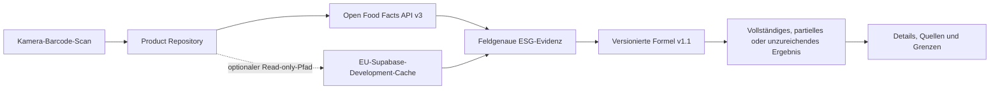

# ScanFair

[English](README.md) | [Projektstatus](docs/project/STATUS.md) | [Interaktiver Prototyp](docs/05-prototype.html) | [Quality Gates](docs/project/quality-strategy.md)

[](https://github.com/MustDemir/ESG-Score-App/actions/workflows/quality-gates.yml)

> Produkte scannen. Evidenz verstehen. Bewusster entscheiden.

ScanFair ist eine iOS-first Flutter-App, die einen Lebensmittel-Barcode in
einen erklärbaren ESG-Orientierungsscore übersetzt. Sie verbindet das
Produkterlebnis mit feldgenauer Datenprovenienz, versionierten Scoring-Regeln
und Compliance-Kontrollen, die prüfbare CI-Evidenz erzeugen.

**Projektrolle:** AI-gestütztes, compliance-orientiertes Product Engineering
mit Technical Product Ownership, DevSecOps und Data Governance.

**Aktueller Stand (31. August 2026):** Der lokale MVP ist implementiert und auf
einem physischen iPhone validiert. Die Development-Pipeline besteht.
TestFlight, App-Store-Submission, öffentliche Produktionsruntime und
Online-Release bleiben bewusst deaktiviert.

<p align="center">
  
</p>

## Warum ScanFair?

Kaufentscheidungen entstehen am Regal unter Zeitdruck. Gleichzeitig sind
Nachhaltigkeitsinformationen fragmentiert, schwer vergleichbar und werden oft
ohne ihre Grenzen präsentiert. ScanFair untersucht, wie ein mobiles Produkt
diese Informationen nutzbar machen kann, ohne Unsicherheit hinter einer
einzigen undurchsichtigen Zahl zu verstecken.

Der MVP konzentriert sich auf eine klare Produktschleife:

`App öffnen -> Barcode scannen -> Produkt erkennen -> Score prüfen -> Details nachvollziehen`

## Produkterlebnis

| Funktion | Implementiertes Verhalten |
| --- | --- |
| Barcode-Scan | Echter EAN-/UPC-Kamerascanner mit Taschenlampe, Lifecycle und Permission-Behandlung |
| Produktabfrage | Open Food Facts API v3 mit typisierten Fehlern, Timeout, Retry und begrenzten Antworten |
| ESG-Ergebnis | Environmental-, Social- und Governance-Säulen mit vollständigem, partiellem oder unzureichendem Datenstand |
| Erklärung | Faktoren, Quellenreferenzen, Datenqualität und Methodikversion in der Detailansicht |
| Ernährung | Separate neutrale Fakten; weder Bestandteil des ESG-Scores noch als Health-Score dargestellt |
| Fehlerzustände | Kamerasperre, kein Treffer, dünne Evidenz, Netzwerkfehler und gekennzeichneter Stale-Cache-Fallback |
| Accessibility | VoiceOver-Semantik, Sprachwechsel für Fachbegriffe, Dynamic Type, Fokusreihenfolge und Reduce Motion |
| Referenzfall | Drei reproduzierbare Kaffee-GTINs mit produktgebundener Rohstoff- und Herkunftsevidenz |

Zur Produktgestaltung gehören [Research-Synthese](docs/DESIGN-SYNTHESIS.md),
[Hi-Fi-Screens](docs/02-screens.html), ein
[klickbarer Prototyp](docs/05-prototype.html) und ein Implementierungs-Handoff.

## Was ScanFair anders macht

1. **Evidenz vor Score.** Relevante Quellfelder werden zu expliziten
   `ESGEvidence`-Einträgen mit Quelle, Lizenz, Abrufzeit und Qualitätsklasse.
2. **Keine erfundene Sicherheit.** Fehlende Säulen werden weder positiv, neutral
   noch als Null ersetzt. Ohne Environmental-Evidenz gibt es keinen
   aggregierten ESG-Score.
3. **Begrenzte Aussagen.** Ein Kategorieproxy bleibt als solcher gekennzeichnet,
   ein Risikosignal wird nicht als Produktbefund ausgegeben und der Score wird
   nicht als Zertifizierung oder rechtliche Compliance-Entscheidung bezeichnet.
4. **Compliance als Engineering-Kontrolle.** Anforderungen werden in
   strukturierte Gates, Rego-/Validator-Policies, CI-Entscheidungen und
   gespeicherte Evidenz übersetzt, statt erst kurz vor einem Release geprüft zu
   werden.
5. **Ein gemeinsamer Produktlebenszyklus.** Discovery, UX, Mobile-Code,
   Scoring, Data Governance, Accessibility, Security und Release Readiness
   werden zusammen entwickelt und bewertet.

## Funktionsweise



Der Flutter-Client verwendet standardmäßig den direkten Open-Food-Facts-Pfad.
Ein read-only Supabase-Cache-Adapter ist konfigurierbar, der Remote-App- und
Runtime-Pfad ist derzeit aber deaktiviert. Ein nicht mobiler Trusted Writer,
Datenbank-RPCs und Retention-Kontrollen liegen hinter einer fail-closed
Aktivierungsgrenze.

### Scoring-Vertrag

| Säule | MVP-Gewicht | Aktuelle Evidenzgrenze |
| --- | ---: | --- |
| Environmental | 50 % | Open Food Facts Environmental-Score und zugehörige Produktfelder |
| Social | 30 % | Evidenztragende Labels und Herkunftssignale; noch keine vollständige Lieferkettenbewertung |
| Governance | 20 % | Proxy für Produktdatentransparenz; noch keine vollständigen Unternehmens-Governance-Daten |

Formel v1.1 bildet einen gewichteten Durchschnitt ausschließlich aus belegten
Säulen. Environmental-Evidenz ist für einen Gesamtwert verpflichtend. Ein
Gesamtwert aus weniger als drei Säulen wird ausdrücklich als partiell markiert.
Der breitere Methodikkatalog 2.0 enthält 26 Parameter und Kategorieprofile für
Lebensmittel, Kaffee, Banane und Kakao/Schokolade, bleibt aber bis zur
Kalibrierung und zum Fachreview als Draft inaktiv.

ScanFair bietet Orientierung, keine Zertifizierung, Rechtsberatung oder den
Nachweis, dass ein Produkt nachhaltig ist.

## Engineering und Governance

Die Governance-Kette ist bewusst nachvollziehbar:

```text
Quellenanforderung
  -> strukturierte Anforderung und Gate-Definition mit sieben Kernattributen
  -> Rego-Policy oder deterministischer Validator
  -> lokale und GitHub-Actions-Entscheidung
  -> Markdown-/JSON-Evidenz und Audit-Referenz
```

Jedes kanonische Gate definiert `trigger`, `criteria`, `artifacts`, `decision`,
`owner`, `audit` und `waiver`. Enforcement-Profile trennen die tägliche
Entwicklung von der Release-Freigabe:

| Profil | Zweck |
| --- | --- |
| `development` | Blockiert objektive Fehler und hält spätere Release-Evidenz als Warnung sichtbar |
| `release_candidate` | Blockiert jede anwendbare offene MUST-Anforderung und fehlende qualifizierte Evidenz |
| `submission` | Ergänzt finale manuelle Bestätigungen für eine App-Store-Entscheidung |

### Quality Gates

| Kontrollbereich | Repräsentative Prüfungen |
| --- | --- |
| Flutter-Qualität | Dependencies, Format, statische Analyse, Tests und `G-FLT-COVERAGE` |
| Natives iOS | `G-IOS-COMPILE`, Privacy-Manifest-Audit und Evidenz vom physischen Gerät |
| Scoring und Daten | `G-DATA-ARCH`, Missing-Data-Safety, Reproduzierbarkeit, Quellenlinks und Red Flags |
| Security und Privacy | `G-MASVS`, Supply-Chain-Inventar, Secret Scan, Claim- und Privacy-Grenzen |
| Apple Compliance | `G-CMP-APPLE` über acht Apple-Gate-Gruppen und Enforcement-Profile |
| Backend Governance | RLS/pgTAP, Trusted-Writer-Grenze, Provider Governance und Retention Operations |
| Projektsteuerung | YAML, Doku-Traceability, Gap-Register, ADRs und Evidence Chain |

Der vollständige Gate-Katalog, die Kommandos und Release-Kriterien stehen in
der [Quality-Strategie](docs/project/quality-strategy.md). Kubernetes und
Gatekeeper sind für dieses Mobile-Projekt bewusst ausgeschlossen.

### Validierter Development-Stand

| Evidenz | Validiertes Ergebnis |
| --- | ---: |
| Lokale Development-Gates | 30/30 PASS |
| Flutter-Tests | 122/122 PASS |
| Flutter Line Coverage | 84,33 % |
| Lokaler Datenbank-Replay und pgTAP | 13 Migrationen, 250/250 PASS |
| Supply-Chain-Inventar | 61 Dart-Pakete, 2 iOS-Plugins, 20 gepinnte Action-Referenzen, 0 bekannte Schwachstellen |
| Pull Request 30 GitHub Actions | 6/6 Jobs PASS |

Diese Ergebnisse belegen die aktuelle **Development-Baseline**, nicht die
App-Store-Reife. Das strikte Release-Candidate-Profil bleibt erwartungsgemäß
blockiert, bis Apple-, MASVS-, Privacy-, Claim-, Lizenz-, Provider- und
Signed-Archive-Evidenz vollständig vorliegt.

## Nachgewiesene Methoden und Fähigkeiten

| Disziplin | Angewandte Methoden und Repository-Evidenz |
| --- | --- |
| Product und UX | Design Thinking, Personas, Customer Journey, Value Proposition Canvas, Lean MVP und accessible Interaction Design |
| Product Ownership | priorisierte Roadmap, risikobasiertes Backlog, Definition of Ready/Done und explizite Scope-Entscheidungen |
| Software Engineering | vertikale Schnitte, Constructor Injection, typisierte Adapter, defensive Fallbacks und ADRs |
| Quality Engineering | Unit-, Service-, Mapper-, Widget-, Policy-, Datenbank-, Native-Build- und Device-Tests |
| ESG-Methodik | versionierte Parameter, Precedence, Non-Compensation, Missing-Data-Safety und Kalibrierungsplan |
| Data Governance | Provenienz, Quellenlizenzen, kontextgebundene Beziehungen, RLS, Retention und reproduzierbare Snapshots |
| DevSecOps | GitHub Actions, Policy as Code, Supply-Chain-Kontrollen, Threat Modeling und auditierbare Evidenz |
| Continuous Governance | Lifecycle Gap Analysis, Compliance Horizon Scans und fail-closed Aktivierungsprofile |

Das vollständige Vorgehen steht im
[Product Engineering Handbook](docs/project/methodology/product-engineering-handbook.md),
im [Delivery Operating Model](docs/project/delivery-operating-model.md) und in
der [Lifecycle Gap Analysis](docs/project/methodology/gap-analysis-process.md).

## Tech Stack

| Ebene | Technologie |
| --- | --- |
| Mobile | Flutter 3.44.0, Dart 3.12, Material-/Cupertino-Integration und lokal gebündelte Brand Fonts |
| Scan und Netzwerk | `mobile_scanner` 7.3.0, `http` 1.6.0, Open Food Facts API v3 |
| App-Architektur | Flutter-native State, Constructor Injection, Repository- und Mapper-Grenzen |
| Datenplattform | Supabase-Development-Projekt in Frankfurt, PostgreSQL-Migrationen, RLS, RPCs und pgTAP |
| Trusted Ingestion | Supabase Edge Function Contract mit serverseitigen Secrets, Rate Limits und Idempotenz |
| Policy und Compliance | OPA/Rego, Conftest, strukturierte YAML-Anforderungen und Evidence Hash Chain |
| CI/CD und Security | GitHub Actions, OSV-Scanner, Gitleaks, Dependency Review und Dependabot |
| iOS-Validierung | Xcode 26.6, Flutter Swift Package Manager, Privacy Manifests und physische iPhone-Tests |
| Automatisierung | Bash- und Ruby-Validatoren, SQL-Tests sowie JSON-/Markdown-Evidenzartefakte |

## Aktueller Reifegrad

**Erledigt:** Discovery und Design-System, vollständiger lokaler
Scan-to-Detail-MVP, evidence-first Datenmodell, Kaffee-Referenzpfad,
Accessibility-Härtung, lokales/CI-Quality-System und abgeglichenes
Frankfurt-Development-Schema.

**In Arbeit:** Remote Retention Observability, Read-Abuse-Schutz,
qualifizierte DPA-/Lizenz-/Privacy-Reviews und das Compliance-Horizon-Update
2026.

**Nächste Produktdaten-Meilensteine:** WRI Aqueduct als Umweltkontext, ILAB
für Social-/Rohstoff-Länderrisiken, GLEIF/BRIS für Rechtsträger-Mapping sowie
Methodikkalibrierung und unabhängiges Fachreview. Diese Quellen werden erst
nach bestandenen Mapping-, Lizenz-, Claim- und Kalibrierungskontrollen
score-relevant.

Die detaillierte, datierte Meilensteinsicht liegt im
[Projektstatus](docs/project/STATUS.md). Maschinenlesbare Source of Truth
bleiben [`progress.yaml`](docs/project/progress.yaml) und
[`backlog.yaml`](docs/project/backlog.yaml).

## Lokal starten

```bash
cd esg_app
flutter pub get
flutter run
```

Die reproduzierbare lokale Pipeline wird im Repository-Root gestartet:

```bash
bash scripts/quality/run_quality_gates.sh
```

Die ausführliche iPhone-Einrichtung und Flutter-Kommandos stehen in der
[App-Entwicklungs-README](esg_app/README.md). Das Projekt führt kein
automatisches Deployment oder Release aus.

## Dokumentation

| Einstieg | Zweck |
| --- | --- |
| [Projektstatus](docs/project/STATUS.md) | Reifegrad, validierter Stand und nächste Meilensteine |
| [Datenarchitektur](docs/project/data/data-architecture.md) | Evidenz, Provenienz, Beziehungen und Supabase-Grenze |
| [Methodikkatalog](docs/project/methodology-catalog/README.md) | Parameter, Profile und Aktivierungsregeln für das Scoring |
| [Quality-Strategie](docs/project/quality-strategy.md) | Testmodell, Quality Gates, CI-Jobs und Release-Profile |
| [Apple Compliance Model](docs/project/compliance/apple-compliance-control-model.md) | Requirement-to-Gate-Modell und App-Store-Grenze |
| [Architecture Decisions](docs/project/decisions/INDEX.md) | Versionierte technische und fachliche Entscheidungen |
| [Verbesserungsregister](docs/project/improvement-register.yaml) | Priorisierte Prozess-, Compliance-, Entwicklungs- und Betriebsverbesserungen |

## Autor

**Mustafa Demir**  
Digital Transformation Consulting, AI und Cloud Solution Architecture

ScanFair zeigt, wie ein verbrauchernahes Mobile-Produkt als auditierbares
Engineering-System entwickelt werden kann: am Regal nützlich, ehrlich zur
Evidenz und auf zunehmend strengere Release-Kontrollen vorbereitet.
