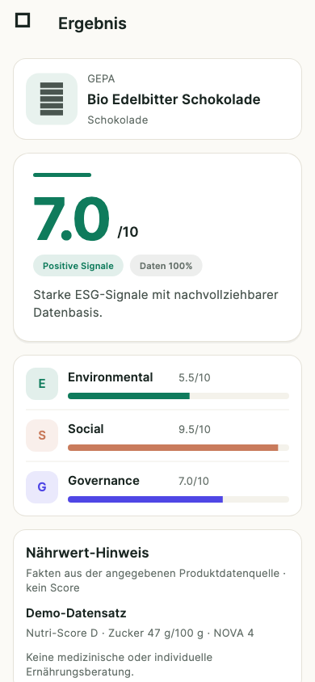
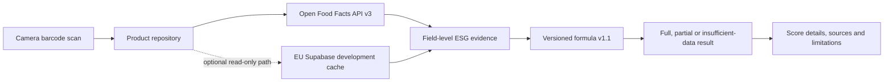

# ScanFair

[Deutsch](README.de.md) | [Project status](docs/project/STATUS.md) | [Interactive prototype](docs/05-prototype.html) | [Quality Gates](docs/project/quality-strategy.md)

[](https://github.com/MustDemir/ESG-Score-App/actions/workflows/quality-gates.yml)

> Scan products. Understand the evidence. Make better-informed choices.

ScanFair is an iOS-first Flutter application that turns a food barcode into an
explainable ESG orientation score. It combines the product experience with
field-level data provenance, versioned scoring rules and compliance controls
that produce auditable CI evidence.

**Project role:** AI-assisted, compliance-oriented Product Engineering with
Technical Product Ownership, DevSecOps and Data Governance.

**Current status (31 August 2026):** the local MVP is implemented and validated
on a physical iPhone. The development pipeline passes. TestFlight, App Store
submission, public production runtime and online release remain intentionally
disabled.

<p align="center">
  
</p>

## Why ScanFair

Consumers make decisions at the shelf under time pressure, while sustainability
information is fragmented, difficult to compare and often presented without
its limitations. ScanFair explores how a mobile product can make this
information useful without hiding uncertainty behind a single opaque number.

The MVP follows one focused product loop:

`Open app -> scan barcode -> identify product -> inspect score -> verify details`

## Product Experience

| Capability | Implemented behaviour |
| --- | --- |
| Barcode scan | Real EAN/UPC camera scan with torch, lifecycle and permission handling |
| Product lookup | Open Food Facts API v3 with typed errors, timeout, retry and bounded responses |
| ESG result | Environmental, Social and Governance pillars with full, partial or insufficient-data state |
| Explanation | Factor-level detail, source references, data quality and methodology version |
| Nutrition | Separate neutral facts; never mixed into the ESG score or presented as a health score |
| Failure states | Camera denial, no result, thin evidence, network failure and stale-cache fallback |
| Accessibility | VoiceOver semantics, language switching for terminology, Dynamic Type, focus order and Reduce Motion |
| Reference case | Three reproducible coffee GTINs with product-bound commodity and origin evidence |

The visual product work includes [research synthesis](docs/DESIGN-SYNTHESIS.md),
[high-fidelity screens](docs/02-screens.html), a
[clickable prototype](docs/05-prototype.html) and an implementation handoff.

## What Makes It Different

1. **Evidence before score.** Relevant source fields become explicit
   `ESGEvidence` records with source, licence, retrieval time and quality class.
2. **No fabricated certainty.** Missing pillars are not replaced by positive,
   neutral or zero values. Without Environmental evidence, no aggregate ESG
   score is shown.
3. **Bounded claims.** A category proxy is labelled as a category proxy, a risk
   signal is not presented as a product finding, and the score is not described
   as a certification or legal-compliance decision.
4. **Compliance as an engineering control.** Requirements are translated into
   structured gates, Rego/validator policies, CI decisions and retained
   evidence rather than being checked only before release.
5. **One product lifecycle.** Discovery, UX, mobile code, scoring, data
   governance, accessibility, security and release readiness are developed and
   reviewed together.

## How It Works



The Flutter client defaults to the direct Open Food Facts path. A read-only
Supabase cache adapter can be configured, but the remote app/runtime path is
currently disabled. A non-mobile trusted writer, database RPCs and retention
controls are implemented behind a fail-closed activation boundary.

### Scoring Contract

| Pillar | MVP weight | Current evidence boundary |
| --- | ---: | --- |
| Environmental | 50% | Open Food Facts Environmental-Score and related product fields |
| Social | 30% | Evidence-bearing labels and origin signals; not yet a complete supply-chain assessment |
| Governance | 20% | Product-data transparency proxy; not yet full corporate governance data |

Formula v1.1 calculates a weighted average only from evidenced pillars.
Environmental evidence is mandatory for an aggregate. An aggregate based on
fewer than all three pillars is explicitly marked as partial. The broader
methodology 2.0 catalogue contains 26 parameters and category profiles for
food, coffee, banana and cocoa/chocolate, but remains draft and inactive until
calibration and expert review.

ScanFair provides orientation, not certification, legal advice or proof that a
product is sustainable.

## Engineering and Governance

The governance chain is deliberately traceable:

```text
Source requirement
  -> structured requirement and seven-attribute gate definition
  -> Rego policy or deterministic validator
  -> local and GitHub Actions decision
  -> Markdown/JSON evidence and audit reference
```

Every canonical gate defines `trigger`, `criteria`, `artifacts`, `decision`,
`owner`, `audit` and `waiver`. Enforcement profiles separate everyday
development from release readiness:

| Profile | Purpose |
| --- | --- |
| `development` | Blocks objective defects while keeping later release evidence visible as warnings |
| `release_candidate` | Blocks every applicable open MUST requirement and missing qualified evidence |
| `submission` | Adds final manual attestations for an App Store decision |

### Quality Gates

| Control area | Representative checks |
| --- | --- |
| Flutter quality | dependencies, format, static analysis, tests and `G-FLT-COVERAGE` |
| Native iOS | `G-IOS-COMPILE`, privacy-manifest audit and physical-device evidence |
| Scoring and data | `G-DATA-ARCH`, missing-data safety, reproducibility, source links and red flags |
| Security and privacy | `G-MASVS`, supply-chain inventory, secret scan, claims and privacy boundaries |
| Apple compliance | `G-CMP-APPLE` across eight Apple gate groups and enforcement profiles |
| Backend governance | RLS/pgTAP, trusted-writer boundary, provider governance and retention operations |
| Project controls | YAML, documentation traceability, gap register, ADRs and evidence chain |

The complete gate catalogue, commands and release criteria live in the
[quality strategy](docs/project/quality-strategy.md). Kubernetes and Gatekeeper
are intentionally outside this mobile project.

### Verified Development Baseline

| Evidence | Verified result |
| --- | ---: |
| Local development gates | 30/30 PASS |
| Flutter tests | 122/122 PASS |
| Flutter line coverage | 84.33% |
| Local database replay and pgTAP | 13 migrations, 250/250 PASS |
| Supply-chain inventory | 61 Dart packages, 2 iOS plugins, 20 pinned Action references, 0 known vulnerabilities |
| Pull Request 30 GitHub Actions | 6/6 jobs PASS |

These results prove the current **development baseline**, not App Store
readiness. The strict release-candidate profile is expected to remain blocked
until Apple, MASVS, privacy, claims, licensing, provider and signed-archive
evidence is complete.

## Methods and Capabilities Demonstrated

| Discipline | Applied methods and repository evidence |
| --- | --- |
| Product and UX | Design Thinking, personas, Customer Journey, Value Proposition Canvas, Lean MVP and accessible interaction design |
| Product ownership | prioritised roadmap, risk-based backlog, Definition of Ready/Done and explicit scope decisions |
| Software engineering | vertical slices, constructor injection, typed adapters, defensive fallback states and ADRs |
| Quality engineering | unit, service, mapper, widget, policy, database, native build and physical-device testing |
| ESG methodology | versioned parameters, precedence rules, non-compensation, missing-data safety and calibration plan |
| Data governance | provenance, source licensing, context-bound relationships, RLS, retention and reproducible snapshots |
| DevSecOps | GitHub Actions, Policy as Code, supply-chain controls, threat modelling and auditable evidence |
| Continuous governance | lifecycle gap analysis, compliance horizon scans and fail-closed activation profiles |

The complete approach is documented in the
[Product Engineering Handbook](docs/project/methodology/product-engineering-handbook.md),
the [Delivery Operating Model](docs/project/delivery-operating-model.md) and the
[Lifecycle Gap Analysis](docs/project/methodology/gap-analysis-process.md).

## Technology Stack

| Layer | Technology |
| --- | --- |
| Mobile | Flutter 3.44.0, Dart 3.12, Material/Cupertino integration and locally bundled brand fonts |
| Scanning and network | `mobile_scanner` 7.3.0, `http` 1.6.0, Open Food Facts API v3 |
| App architecture | Flutter-native state, constructor injection, repository and mapper boundaries |
| Data platform | Supabase development project in Frankfurt, PostgreSQL migrations, RLS, RPCs and pgTAP |
| Trusted ingestion | Supabase Edge Function contract with server-only secrets, rate limits and idempotency |
| Policy and compliance | OPA/Rego, Conftest, structured YAML requirements and evidence hash chain |
| CI/CD and security | GitHub Actions, OSV-Scanner, Gitleaks, Dependency Review and Dependabot |
| iOS validation | Xcode 26.6, Flutter Swift Package Manager, Privacy Manifests and physical iPhone tests |
| Automation | Bash and Ruby validators, SQL tests, JSON/Markdown evidence artifacts |

## Current Maturity

**Delivered:** discovery and design system, complete local scan-to-detail MVP,
evidence-first data model, coffee reference path, accessibility hardening,
local/CI quality system and a reconciled Frankfurt development schema.

**In progress:** remote retention observability, read-abuse protection,
qualified DPA/licence/privacy reviews and the 2026 compliance horizon update.

**Next product-data milestones:** WRI Aqueduct environmental context, ILAB
social/commodity-country risk, GLEIF/BRIS legal-entity mapping, methodology
calibration and independent domain review. These sources will become
score-relevant only after mapping, licence, claim and calibration controls pass.

The detailed, dated milestone view is maintained in
[Project Status](docs/project/STATUS.md); machine-readable truth remains in
[`progress.yaml`](docs/project/progress.yaml) and
[`backlog.yaml`](docs/project/backlog.yaml).

## Run Locally

```bash
cd esg_app
flutter pub get
flutter run
```

Run the reproducible local pipeline from the repository root:

```bash
bash scripts/quality/run_quality_gates.sh
```

Detailed iPhone setup and Flutter commands are kept in the
[app development README](esg_app/README.md). The project performs no automatic
deployment or release.

## Documentation

| Entry point | Purpose |
| --- | --- |
| [Project Status](docs/project/STATUS.md) | Current maturity, verified baseline and next milestones |
| [Data Architecture](docs/project/data/data-architecture.md) | Evidence, provenance, relationships and Supabase boundary |
| [Methodology Catalogue](docs/project/methodology-catalog/README.md) | Parameters, profiles and scoring activation rules |
| [Quality Strategy](docs/project/quality-strategy.md) | Test model, Quality Gates, CI jobs and release profiles |
| [Apple Compliance Model](docs/project/compliance/apple-compliance-control-model.md) | Requirement-to-gate control model and App Store boundary |
| [Architecture Decisions](docs/project/decisions/INDEX.md) | Versioned technical and product decisions |
| [Improvement Register](docs/project/improvement-register.yaml) | Prioritised process, compliance, development and operations improvements |

## Author

**Mustafa Demir**  
Digital Transformation Consulting, AI and Cloud Solution Architecture

ScanFair demonstrates how a consumer-facing mobile product can be built as an
auditable engineering system: useful at the shelf, honest about its evidence
and prepared for progressively stricter release controls.
