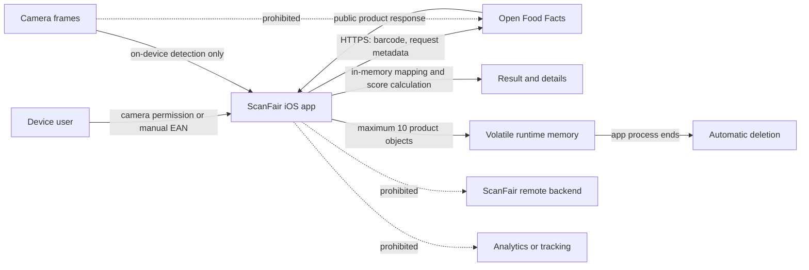
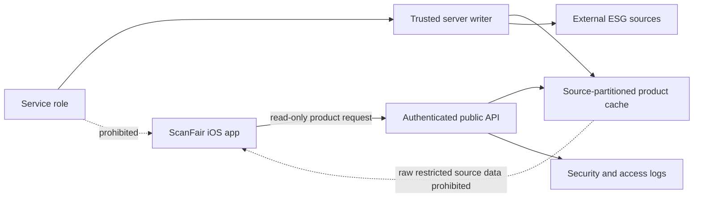
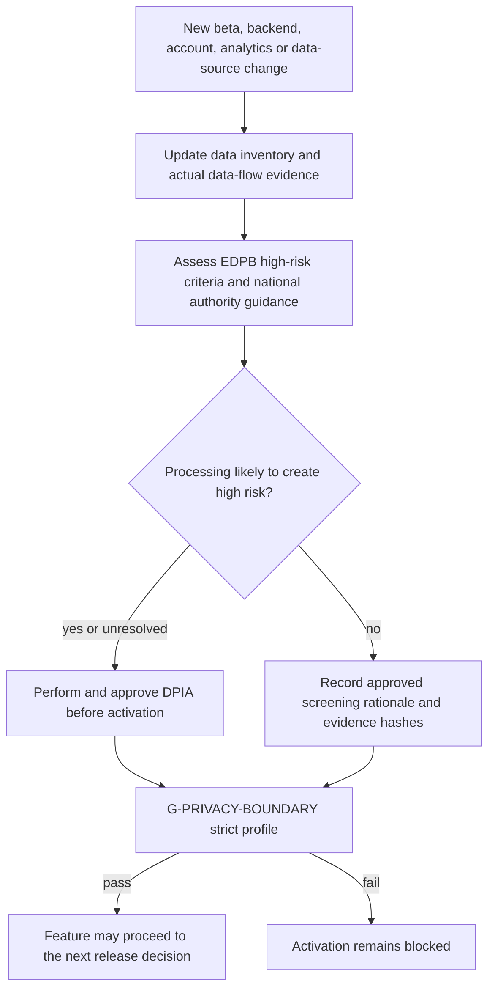

# ScanFair Privacy Data Flow and DPIA Decision Path

Status: accepted for local development

Last reviewed: 2026-09-24

Owner: Mustafa Demir

This document describes the current iOS MVP. Planned components are shown as
disabled boundaries and must not be interpreted as active processing. The
machine-readable source of truth is
[`privacy-data-inventory.yaml`](privacy-data-inventory.yaml).

## Current Data Flow

Current guarantees:

- Camera images are neither returned by the scanner nor persisted or uploaded.
- The decoded barcode is sent directly to Open Food Facts only after a user
  scan or manual lookup.
- Inter and Instrument Serif are bundled with the app. Runtime fetching is
  disabled, so typography creates no request to Google Fonts or another font
  provider.
- ScanFair adds no account, advertising or device identifier to the request.
- Network infrastructure and Open Food Facts can nevertheless process network
  metadata such as the IP address; provider roles, region and retention still
  require qualified review before external beta.
- Product objects are limited to ten entries in volatile app memory. There is
  no ScanFair cloud history, account, analytics, tracking or location feature.

## Planned Remote Boundary

This path remains disabled until NEXT-04 defines its threat model and NEXT-05
meets the license, privacy, security, retention, rights and processor evidence
contracts. Enabling a remote backend changes the applicable gate profile.

### Planned Public-Read Rate Limit (PRV-008)

```mermaid
flowchart LR
  A["ScanFair iOS app or any HTTP client"] -->|POST to one of three read RPCs| I["Trusted ingress"]
  I -->|appends observed peer to X-Forwarded-For| P["PostgREST pre-request hook"]
  P -->|final entry parsed as inet, transaction only| H["HMAC-SHA-256 with hourly random key"]
  K["private.public_read_rate_keys, one key per UTC hour"] --> H
  H -->|subject_hash, window, count, expiry| T["private.public_read_rate_windows"]
  P -->|over 30 per minute: 429| A
  P -->|missing or invalid IP: 403| A
  T -->|expires 1 hour after window start| C["pg_cron cleanup every 5 minutes, max 10,000 rows"]
  C -->|erases keys of past hours| K

  P -. raw IP storage prohibited .-> T
```

The limiter protects the three public read RPCs from enumeration and quota
exhaustion. It is defined by migrations 14 to 16 and ADR 0040, validated
locally by 78 pgTAP and 292 HTTP assertions. **The Supabase GitHub integration
applied migrations 14 to 16 to `scanfair-dev` when their pull requests were
merged (23 and 24 September 2026), before the privacy decision.** The hook is
active there, but the app is not released and does not call the backend by
default; on 24 September the counter and key tables were empty. See the
[incident report](../audits/2026-09-24-remote-auto-deploy-incident.md).

- Only the final `X-Forwarded-For` entry appended by the trusted ingress is
  used. It is processed transiently and never written to a table.
- The stored `subject_hash` is an HMAC-SHA-256 under a random 32-byte key that
  is generated in the database for each UTC hour and never leaves the private
  schema. The same address is linkable only within that hour; the next hour
  yields a different, unlinkable value.
- Keys of past hours are erased by the first request of a new hour and by the
  five-minute cleanup. After erasure, remaining counter rows can no longer be
  attributed to an IP address. During the current hour, an actor with
  privileged database access could still test IP candidates, so the data stays
  pseudonymous, not anonymous.
- The counter and key tables and the derivation function are revoked from
  `public`, `anon`, `authenticated` and `service_role`; only the
  security-definer hook writes to them.
- Logical expiry is one hour. Physical deletion happens in the next healthy
  five-minute cleanup run; a scheduler outage or a backlog above 10,000 rows
  per run has no hard upper bound yet.
- The hosted proxy chain, distinct-client mapping and provider gateway log
  retention are not verified remotely.

Activation requires the scoped legal and DPIA decisions prepared in
[`review/tkt-037-01/`](review/tkt-037-01/README.md). The machine-readable
record is `PRV-008` in the inventory.

## DPIA Decision Path

The current local-only preliminary view is `DPIA not required`, because there
is no persistent user profile, special-category data request, location
tracking, large-scale monitoring or decision about a person. This is not a
legal approval. External beta and every remote feature require a documented,
qualified DPIA screening. Uncertainty is treated as a blocker, not as a waiver.

## Change Triggers

Re-run the inventory, DPIA screening and App Privacy classification whenever a
change introduces or modifies:

- off-device retention, a backend, user account or scan history;
- analytics, diagnostics, tracking, advertising or location;
- a new SDK, processor, subprocessor, region or international transfer;
- a new purpose, data type, recipient, retention period or user-rights path;
- matching of product interactions with an identifiable person;
- children or other vulnerable data subjects.

Primary controls: GDPR Articles 5, 6, 13, 25, 28, 30, 32 and 35; EDPB DPIA
Guidelines WP248 rev.01; BfDI DPIA guidance; Apple App Privacy Details and App
Review Guidelines.
