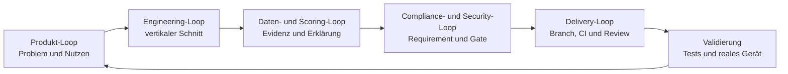

# ScanFair Product Engineering Handbook

Status: lebendes Projekthandbuch
Version: 1.0
Stand: 2026-08-10
Owner: Mustafa Demir
Arbeitsmodell: AI-gestütztes, compliance-orientiertes Product Engineering mit
Technical Product Ownership, DevSecOps und Data Governance

## 1. Zweck und Geltungsbereich

Dieses Handbuch erklärt, **wie ScanFair entwickelt wird**, welches Wissen für
eine belastbare iOS-/ESG-App notwendig ist und welche Teile davon bereits
nachweisbar umgesetzt wurden. Es verbindet Produktarbeit, App-Entwicklung,
ESG-Methodik, Datenarchitektur, Testing, Accessibility, Security, Compliance,
DevOps und Release Governance zu einem durchgängigen Vorgehensmodell.

Das Handbuch hat drei Sichtweisen:

1. **Soll-Wissen:** Was bei einer solchen App grundsätzlich beherrscht und
   geprüft werden muss.
2. **ScanFair-Ist-Stand:** Was im Repository, in CI oder auf einem realen
   iPhone bereits belegt ist.
3. **Reifepfad:** Was noch fehlt, bevor aus dem lokalen MVP ein fachlich
   kalibrierter, betriebsfähiger und App-Store-fähiger Release wird.

Das verbindliche Regelwerk bleibt das
[Delivery Operating Model](../delivery-operating-model.md). Dieses Handbuch ist
die praktische Bedienungsanleitung dazu. Fortschrittswerte werden ausschließlich
in [`progress.yaml`](../progress.yaml) gepflegt; Entscheidungen ausschließlich
als ADRs in [`decisions/`](../decisions/).

## 2. Unser Modell in einem Satz

ScanFair wird als **kleiner, überprüfbarer vertikaler Produktschnitt** entwickelt,
bei dem Nutzerwert, Code, Datenherkunft, Scoring-Regeln, Datenschutz,
Accessibility und Release-Evidenz gemeinsam betrachtet werden.



Keine Schleife ersetzt die andere. Eine funktionierende Kamera ist noch kein
korrekter Score; ein grüner Unit-Test ist noch kein Datenschutz-Nachweis; eine
grüne Development-Pipeline ist noch keine App-Store-Freigabe.

## 3. Wissens- und Disziplinenlandkarte

### 3.1 Product Discovery und Product Ownership

**Notwendiges Wissen**

- Nutzerproblem, Zielgruppe und Nutzungskontext am Point of Sale
- Hypothesen, Value Proposition, Priorisierung und MVP-Scope
- testbare Akzeptanzkriterien und bewusster Nicht-Scope
- Nutzen-, Risiko- und Releaseentscheidung durch einen verantwortlichen Owner

**Bei ScanFair umgesetzt**

- Personas, Customer Journey, Value Proposition und Conjoint-Priorisierung
- Lebensmittel als erster MVP-Scope; iOS zuerst, Android später
- klare Kernschleife: Öffnen, scannen, Produkt finden, Score verstehen, Details
  prüfen
- Roadmap, Backlog, Risiken, Definition of Ready und Definition of Done als
  versionierte Projekt-SSOT

**Methode**

Design Thinking + Lean MVP + Technical Product Ownership + vertikale Schnitte.

### 3.2 UX, UI und Accessibility

**Notwendiges Wissen**

- Informationshierarchie, Fehlerzustände und verständliche Unsicherheit
- iOS-Interaktionsmuster, Dynamic Type, Kontrast, Fokusreihenfolge und Reduce
  Motion
- VoiceOver-Semantik, sprachsichere Aussprache und Bedienung ohne Sehen
- reale Device-Tests zusätzlich zu Widget-Tests

**Bei ScanFair umgesetzt**

- Design-System, Wireframes, Hi-Fi-Screens, klickbarer Prototyp und
  Developer-Handoff
- Home-, Scanner-, Ergebnis- und Detailflow sowie Permission-, Not-Found-,
  Low-Data- und API-Fehlerzustände
- automatisierte Kontrast-, Semantik- und 200-Prozent-Textskalierungschecks
- deutscher App-Locale-Kontext und Terminologiekatalog für deutsche,
  englische und buchstabierte VoiceOver-Begriffe
- Fokusreihenfolge, Reduce Motion, Kamera-Fallback und gemischte Aussprache auf
  einem realen iPhone geprüft

**Methode**

Human-Centred Design + Accessibility by Design + automatisierte und manuelle
Device-Evidenz.

### 3.3 Mobile- und iOS-Engineering

**Notwendiges Wissen**

- Flutter-/Dart-Architektur, State, Dependency Injection und Fehlergrenzen
- iOS-Lifecycle, Kamera-Permissions, Signing, Privacy Manifest und Buildsystem
- Netzwerk-Timeouts, Retries, Rate Limits und sichere Fallbacks
- Debug-, Profile-, Simulator- und signierte Release-Builds unterscheiden

**Bei ScanFair umgesetzt**

- Flutter-App mit constructor-injizierten Repositories und lokaler
  State-Verwaltung
- nativer EAN-/UPC-Kamerascanner über `mobile_scanner`
- Open-Food-Facts-v3-Service mit HTTPS, User-Agent, Timeout, Retry und
  transparenten technischen Fehlern
- iOS-Simulator-Compile-Gate, Privacy-Bundle-Audit und Installation auf einem
  physischen iPhone
- signierter Xcode-Release-Build wurde auf dem Testgerät gestartet; der
  reproduzierbare Release-Archive-Nachweis bleibt offen

**Methode**

Clean Boundaries im MVP-Umfang + Dependency Injection + defensive
Fehlerbehandlung + iOS-first Device Validation.

### 3.4 ESG-Domäne und Scoring-Methodik

**Notwendiges Wissen**

- klare Trennung von Environmental, Social, Governance und Health
- Parameterdefinition, Einheit, Richtung, Normalisierung, Gewichtung und
  Aggregation
- Umgang mit fehlenden Daten, Confidence, Proxies und schweren Red Flags
- Kalibrierung gegen Referenzfälle und Review durch Fachpersonen
- Kundenaussagen müssen schwächer oder gleich stark wie ihre Evidenz sein

**Bei ScanFair umgesetzt**

- aktive MVP-Formel v1.0 und getrennte E-/S-/G-Darstellung
- Environmental-Evidenz ist Voraussetzung für einen Gesamt-ESG-Score
- fehlende Säulen werden weder positiv noch neutral noch als null imputiert
- 39 gezielte Calculator-Fälle für Precedence, Grenzwerte, Zweige und ungültige
  Zahlen
- Methodikkatalog `2.0-draft` mit 26 Parametern und Profilen für Lebensmittel,
  Kaffee, Banane und Kakao/Schokolade
- Gewichte und zusätzliche Risikofaktoren bleiben bis Kalibrierung und
  Fachreview absichtlich nicht aktiv

**Methode**

Versioned Methodology + Missing-Data Safety + Non-Compensation +
evidence-bounded Claims.

### 3.5 Datenintegration und Data Governance

**Notwendiges Wissen**

- Quellenauswahl nach Autorität, Aktualität, Abdeckung, Lizenz und Granularität
- Feldmapping, Provenienz, Zeitstempel, Confidence und Schema-Version
- Entitäten und Beziehungen statt unsicherer Text- oder Namens-Joins
- Client-/Server-Vertrauensgrenzen, RLS, Migrationen und reproduzierbare
  Score-Snapshots
- Datenkorrektur, Frische, Löschung und Lizenz-Attribution im späteren Betrieb

**Bei ScanFair umgesetzt**

- Open Food Facts als Produktquelle mit feldgenauer Evidenz-Provenienz
- AGRIBALYSE 3.2 als registrierter Umwelt-Kategorieproxy; noch nicht
  score-aktiv
- normalisierte Entitäten für Produkt, Rohstoff, Herkunft, Marke und
  Rechtsträger
- lokales Supabase-/PostgreSQL-Schema mit RLS, Migrationen und privaten Scans
- drei reproduzierbare GEPA-Kaffee-GTINs mit offizieller
  Produktdeklarationsquelle, URL, SHA-256 und Confidence
- produktgebundene Kette `GTIN -> Kaffee -> Herkunft`; ein Ursprung eines
  Produkts kann nicht auf ein anderes Produkt übertragen werden
- kein Gesamt-ESG-Score aus Herkunftsdeklarationen allein

**Methode**

Evidence First + Data Lineage + Least Privilege + Context-bound Relationships
und versionierte Datenverträge.

### 3.6 Software Testing und Quality Engineering

**Notwendiges Wissen**

- risikobasierte Teststrategie statt reiner Testanzahl
- Unit-, Mapper-, Repository-, Widget-, Policy-, Datenbank-, Build- und
  Device-Tests
- positive, negative, Grenzwert- und Manipulationsfälle
- Coverage als Warnsignal, nicht als Beweis fachlicher Korrektheit
- deterministische Tests mit Fixtures; Live-Abfragen nur als ergänzende
  Integrationsprüfung

**Bei ScanFair umgesetzt**

| Testebene | Belegter Stand | Schützt vor |
| --- | ---: | --- |
| Flutter Unit/Widget/Service | 85/85, 82,43 % Line Coverage | Logik-, Mapping-, UI- und Fallback-Regressionen |
| Calculator-Entscheidungsmatrix | 39/39 Fälle | falsche Precedence, Grenzwerte und Imputation |
| Rego-Policy-Tests | automatisiert grün | fehlerhafte Compliance-Entscheidungen |
| Validator-Selbsttests | pro kritischem Gate | Gate-Bypässe und falsche Positiventscheidungen |
| PostgreSQL/pgTAP | 55/55 | RLS-, Constraint- und Relationship-Fehler |
| Static/Format | `analyze --fatal-infos`, `dart format` | statische Fehler und Formatdrift |
| iOS Compile/Privacy Audit | eigener macOS-CI-Job | native Plugin-, Build- und Manifest-Fehler |
| Physisches iPhone | Scanner, Permissions, A11y und Start geprüft | reale Lifecycle- und Bedienungsfehler |

**Methode**

Risk-based Testing + Testpyramide + Contract Tests + Shift Left + reale
Device-Abnahme. Wir arbeiten testgetrieben, wo Regeln zuerst als
Entscheidungsmatrix formulierbar sind, aber behaupten keinen durchgehend
strikten TDD-Prozess.

### 3.7 Security, Privacy und Compliance Engineering

**Notwendiges Wissen**

- Apple App Review Guidelines und technische Apple-Plattformpflichten
- Datenschutzgrundsätze, Dateninventar, Zweckbindung und Datenminimierung
- OWASP MASVS, Secrets, Abhängigkeiten und Software Supply Chain
- Automatisierbares von menschlicher Fach-/Rechtsentscheidung trennen
- kontrollierte Ausnahmen mit Owner, Begründung und Ablaufdatum

**Bei ScanFair umgesetzt**

- 19 Apple-Anforderungen in acht Apple-Gate-Gruppen übersetzt
- drei Enforcement-Profile: `development`, `release_candidate`, `submission`
- Rego-/Conftest-Policies mit fail-closed Runner und SHA-256-Evidence-Chain
- App Privacy Manifest, SDK-/Required-Reason-API-Inventar und Bundle-Audit
- risikobasierte Klassifikation aller 24 OWASP-MASVS-2.1-Kontrollen
- RLS, Secret Scan, sichere HTTPS-API und Verbot von Service Keys im Client
- OSV-, Lizenz-, iOS-Plugin- und Action-SHA-Prüfung
- K8s/Gatekeeper wurde für diese lokale Mobile-App bewusst nicht übernommen

**Methode**

Security by Design + Privacy by Design + Compliance as Code + Policy as Code +
Human Accountability.

### 3.8 DevOps, CI/CD und Software Supply Chain

**Notwendiges Wissen**

- kleine Branches, Pull Requests, reproduzierbare Builds und geschützter
  `main`
- Continuous Integration, automatisierte Qualitätsentscheidungen und
  nachvollziehbare Artefakte
- Versionspins, Lockfiles, Schwachstellenprüfung und Update-Prozess
- Deployment und Release dürfen nicht mit einem grünen Build verwechselt
  werden

**Bei ScanFair umgesetzt**

- ein konsolidierter GitHub-Actions-Workflow statt konkurrierender Pipelines
- lokale Pipeline mit 21/21 bestandenen Gate-Gruppen
- zusätzliche GitHub-Jobs für Supply Chain, Gitleaks, iOS Compile/Privacy und
  echten Supabase-Migration-/RLS-Test
- Actions auf vollständige Commit-SHAs gepinnt; Dependabot und Dependency
  Review aktiv
- 59 Dart-Pakete, zwei iOS-Plugins und 16 Action-Referenzen inventarisiert;
  letzter reproduzierbarer OSV-Lauf ohne bekannte Schwachstelle
- Gate-Reports und technische Evidenz werden als GitHub-Artefakte sichtbar

**Methode**

Trunk-oriented Integration mit kurzlebigen Branches + CI + DevSecOps +
immutable Dependencies + Evidence-producing Pipelines. Aktuell gibt es
bewusst keine automatische Auslieferung: Das `CD` endet vor Deployment und
Submission an einer menschlichen Freigabe.

### 3.9 Architektur, Dokumentation und Wissensmanagement

**Notwendiges Wissen**

- Entscheidungen, Anforderungen, Risiken und Status müssen wiederauffindbar
  und widerspruchsarm sein
- Dokumentation braucht einen eindeutigen Owner und eine Source of Truth
- AI-gestützte Entwicklung benötigt besonders klare Kontext-, Review- und
  Verantwortungsgrenzen

**Bei ScanFair umgesetzt**

- `docs/project/` als Git-versionierte SSOT
- append-only ADRs, Roadmap, Backlog, Risiken, Feature States und
  Verbesserungsregister
- Gate-Definitionen verlinken Requirement, Policy, Evidenz und Entscheidung
- Session-Start-, Pre-Coding- und Post-Feature-Protokolle
- technische Implementierung durch Codex; Produkt-, Methodik-, Claim- und
  Releaseverantwortung bleibt bei Mustafa

**Methode**

Architecture Decision Records + Docs as Code + Context Engineering +
human-in-the-loop AI Engineering.

### 3.10 Release, Betrieb und Product Learning

**Notwendiges Wissen**

- App-Store-Metadaten, Support, Privacy-Angaben, Archive und Review-Evidenz
- TestFlight, Feldtests, Crash-/API-/Datenfrische-Monitoring
- Backup, Restore, Migration, Rollback, Incident und Datenkorrektur
- Feedback muss in priorisierte Produkt- und Qualitätsarbeit zurückfließen

**Bei ScanFair umgesetzt**

- Release-Candidate- und Submission-Profile sind als strenge Kontrollstufen
  modelliert
- offene Apple- und MASVS-MUST-Nachweise bleiben sichtbar und blockieren die
  strengeren Profile
- Release und TestFlight sind bewusst noch nicht erfolgt

**Noch offen**

Remote-Umgebungen, Monitoring, Betriebsprozesse, TestFlight, finale
App-Store-Evidenz und die kontrollierte Releaseentscheidung.

## 4. Die fünf ScanFair-Kontrollschleifen

| Schleife | Leitfrage | Kernartefakte | Abschlussnachweis |
| --- | --- | --- | --- |
| Produkt | Lösen wir ein relevantes Nutzerproblem? | Discovery, Roadmap, Akzeptanzkriterien | validierbarer Nutzerflow |
| Engineering | Ist der Schnitt technisch sauber und fehlertolerant? | Code, ADR, Feature State | Tests, Analyze, Build |
| Daten/Scoring | Ist jedes Ergebnis erklärbar und reproduzierbar? | Quellenregister, Evidenz, Methodik | Lineage, Score-Fingerprint, Safety Gates |
| Compliance/Security | Sind anwendbare Pflichten und Risiken kontrolliert? | Requirements, MASVS, Gates, Policies | Gate-Entscheidung plus Evidence |
| Delivery | Kann die Änderung sicher integriert und zurückverfolgt werden? | Branch, PR, CI, Report | grüne Required Checks und Merge-Evidenz |

Die Besonderheit ist die **gemeinsame Definition of Done**. Ein Feature wird
nicht als fertig markiert, wenn nur die Oberfläche funktioniert. Betroffene
Daten-, Test-, Compliance- und Dokumentationsartefakte gehören zum selben
vertikalen Schnitt.

## 5. Standard-Lifecycle einer Änderung

### Phase A: Orientieren

1. `README.md`, `progress.yaml`, relevante Feature States und ADRs lesen.
2. Aktuellen Git-Status und fremde lokale Änderungen schützen.
3. Ziel, Nutzerwert, Risiko und Nicht-Scope in einem Satz formulieren.

**Exit:** Der nächste kleinste sinnvolle Schnitt ist klar.

### Phase B: Ready machen

1. Akzeptanzkriterien und erwartete Evidenz definieren.
2. Daten-, Lizenz-, Privacy-, Security-, Accessibility- und Claim-Auswirkung
   klassifizieren.
3. Bei langfristiger oder schwer reversibler Entscheidung eine ADR anlegen.
4. Tests und Gates vor der Implementierung benennen.

**Exit:** Definition of Ready erfüllt.

### Phase C: Branch und vertikaler Schnitt

1. Von aktuellem `main` einen fokussierten Branch erstellen.
2. App-Code, Datenvertrag, Fehlerzustand, Tests und Dokumentation gemeinsam
   entwickeln.
3. Unsichere Daten standardmäßig nicht score-aktiv machen.
4. Änderung klein, überprüfbar und rollback-fähig halten.

**Exit:** Der Nutzerflow funktioniert lokal und die Grenzen sind sichtbar.

### Phase D: Mehrschichtig testen

1. Betroffene Unit-, Mapper-, Repository- und Widget-Tests ausführen.
2. Policy- und Validator-Selbsttests ausführen.
3. Bei Schemaänderung Migration-Replay, pgTAP und DB-Lint ausführen.
4. Bei nativer iOS-Änderung Compile-/Privacy-Gate und reales Gerät prüfen.
5. Bei UX-/A11y-Änderung Textskalierung, VoiceOver, Fokus und Reduce Motion
   prüfen.

**Exit:** Alle risikorelevanten Teststufen sind grün oder ein Blocker ist
transparent dokumentiert.

### Phase E: Lokale Quality Gates

```bash
bash scripts/quality/run_quality_gates.sh
bash scripts/quality/run_data_database_gate.sh
bash scripts/quality/run_ios_build_gate.sh
```

Nicht jedes Feature braucht jeden teuren Lauf. Vor einem Pull Request müssen
aber alle **betroffenen** Gates laufen; der vollständige Pipeline-Lauf ist der
Integrationsnachweis.

**Exit:** Gate-Report ist grün und `git diff --check` meldet keinen Befund.

### Phase F: Pull Request und CI

1. Scope, Risiken, Evidenz, Tests, offene Punkte und Rollback im PR nennen.
2. GitHub Actions und Dependency Review abwarten.
3. Findings in Code oder Dokumentation beheben, nicht weginterpretieren.
4. Nur bei grünen Required Checks und gelösten Review-Threads mergen.

**Exit:** Änderung ist reviewt, reproduzierbar und in `main` integriert.

### Phase G: Post-Merge und Lernen

1. Post-Merge-CI prüfen.
2. Fortschritt, Feature State und relevante Evidenz aktualisieren.
3. Neue Erkenntnisse als ADR, Risiko, Backlog- oder Improvement-Eintrag
   festhalten.
4. Nächsten vertikalen Schnitt anhand Risiko und Produktwert priorisieren.

**Exit:** `main` ist grün und die nächste Session kann ohne Kontextverlust
starten.

### Phase H: Release Candidate und Submission

1. `release_candidate` statt `development` ausführen.
2. Alle anwendbaren MUST-Evidenzen schließen.
3. Signiertes Archive, Privacy, Metadata, Support, Claims und Third-Party
   Rights prüfen.
4. TestFlight-/Feldtest, Monitoring, Rollback und menschliche Freigabe
   abschließen.

**Exit:** Erst jetzt darf eine App-Store-Submission entschieden werden.

## 6. Branch-Modell

Branches sind **Änderungskanäle**, keine dauerhaften Umgebungen. `main` ist die
integrierte, grüne Referenz. Ein gemergter Branch darf auf GitHub gelöscht
werden, weil Commit, PR, Review und CI-Evidenz erhalten bleiben.

| Präfix | Zweck | Typische Artefakte | Mindestprüfung |
| --- | --- | --- | --- |
| `feature/` | Nutzerfunktion oder vertikaler Datenfall | App-Code, Datenmodell, Tests, Feature State | Flutter, betroffene Daten-/Scoring-Gates |
| `quality/` | Tests, Accessibility, Audit-Härtung | Testmatrix, Validator, Audit Evidence | vollständige lokale Pipeline |
| `compliance/` | Security-, Privacy- oder Regelkontrolle | Requirement, Gate, Rego, Evidence | Policy-Tests, Supply Chain/MASVS |
| `process/` | Arbeitsmodell, CI-Governance, Projektkontrolle | Operating Model, Workflow, Validator | Projekt- und Dokumentations-Gates |
| `fix/` | fokussierte Fehlerbehebung | Regressionstest, Codefix | betroffene Tests plus Regression |
| `docs/` | reine erklärende Dokumentation | Markdown/YAML | Docs Trace und YAML |
| `dependabot/` | automatischer Abhängigkeitsvorschlag | Lockfile/Workflow-Version | Supply Chain, Build, Tests, Review |

### Historische ScanFair-Branches und ihr Beitrag

| Branch | Einordnung | Ergebnis |
| --- | --- | --- |
| `dev` | frühe Integration | Flutter-Grundlage, Methodik, Theme und erste Compliance-Arbeit nach `main` integriert |
| `feature/apple-compliance-quality-gates` | Compliance + App Feature | MVP, OFF, Scanner und Apple-Gate-System über PR #5 integriert |
| `feature/esg-data-integration` | Data Engineering | Evidence-first Daten- und Scoring-Safety über PR #6 integriert |
| `process/release-foundation` | Prozess/Release | Delivery Operating Model und Release-Grundlage über PR #7 integriert |
| `process/improvement-register` | Prozesssteuerung | Verbesserungsregister und AI-gestützte Arbeitsrolle über PR #8 integriert |
| `compliance/supply-chain-baseline` | DevSecOps | reproduzierbare Supply-Chain-Kontrollen über PR #9 integriert |
| `quality/audit-findings-normalization` | Quality/Audit | Findings, CI- und Action-Pinning-Härtung über PR #14 integriert |
| `quality/scoring-accessibility-masvs` | Quality + Security | Scoring-Testmatrix, Accessibility und MASVS über PR #16 integriert |
| `quality/ios-device-evidence` | Device Quality | VoiceOver-Lokalisierung und iPhone-Evidenz über PR #17 integriert |
| `feature/coffee-reference-case` | aktueller Data-/Product-Slice | drei Kaffee-Piloten und produktgebundene Herkunft lokal grün; Commit/PR noch offen |

Das Branching zeigt auch die Entwicklungsreihenfolge: erst Produkt- und
Architekturgrundlage, dann Compliance-Mechanik, Datenverträge,
Prozesshärtung, Security, Accessibility und schließlich der erste fachliche
Referenzfall.

## 7. Was wir insgesamt gebaut haben

### Produkt und App

- vollständiger lokaler iOS-MVP-Flow vom Barcode bis zur erklärenden
  Detailansicht
- reale Open-Food-Facts-Abfrage und sichere lokale Demo-/Pilot-Fallbacks
- getrennte E-/S-/G-Anzeige, Health als separater Hinweis
- transparente Zustände für fehlende Daten, fehlendes Produkt, API- und
  Kamerafehler

### Daten und Scoring

- normalisiertes Evidenzmodell mit Quelle, Feld, Lizenz, Confidence,
  Zeitstempel und Schema-Version
- Supabase-/PostgreSQL-Zielmodell mit RLS und reproduzierbaren Migrationen
- hierarchischer ESG-Parameterkatalog und versionierte Scoring-Kontrollen
- erste autoritative Umweltquelle als inaktiver Kategorieproxy
- Kaffee-Referenzfall mit drei echten Produkten und produktsicherer
  Herkunftskette

### Qualität und Compliance

- 21 lokale Quality-Gate-Gruppen sowie separate Datenbank- und iOS-CI-Jobs
- Apple Compliance, MASVS, Supply Chain, Privacy und Claims als überprüfbare
  Artefakte statt lose Checklisten
- automatisierte Tests von App, Datenbank, Policies, Validatoren und
  Dokumentationskonsistenz
- reale iPhone-Validierung für Scanner, Permissions, Dynamic Type und
  VoiceOver

### Delivery und Governance

- stabile `main`-Integration über fokussierte Branches und Pull Requests
- GitHub Actions mit sichtbaren Reports und Evidenzartefakten
- SSOT, ADR-System, Fortschritt, Risiken, Backlog, Feature States und
  Verbesserungsregister
- klare menschliche Verantwortung trotz intensiver AI-Unterstützung

## 8. Besonders starke und außergewöhnliche Aspekte

### 8.1 Compliance ist ausführbarer Teil der Entwicklung

Die aus der Masterarbeit stammende Quality-Gate-Architektur wurde nicht einfach
kopiert, sondern passend zur Mobile-App auf Apple, DSGVO, MASVS und Claims
übertragen. Requirement, Gate, Rego-Policy, Test und Evidence bilden eine
prüfbare Kette. Für einen Solo-MVP ist diese Nachvollziehbarkeit ungewöhnlich
weit entwickelt.

### 8.2 Die App verweigert Scheingenauigkeit

Fehlende Environmental-Evidenz blockiert den Gesamt-ESG-Score. Unsichere
Herkunfts- oder Community-Hinweise werden nicht stillschweigend zu positiven
Fakten. Das ist fachlich wertvoller als ein stets verfügbarer, aber nicht
belegbarer Score.

### 8.3 Ein fachliches Datenproblem wurde über alle Schichten geschlossen

Die Gefahr, dass die globale Entität „Kaffee“ eine Herkunft zwischen Produkten
überträgt, wurde nicht nur im UI korrigiert. Produktkontext ist jetzt im
Dart-Modell, PostgreSQL-Constraint, RLS-Verhalten, Gate-Validator, ADR und in
Tests verankert. Diese End-to-End-Absicherung ist ein sehr gutes Beispiel für
sauberes Product Engineering.

### 8.4 Accessibility wurde mit dem Nutzer geprüft

VoiceOver, Sprache, Fokus, Textskalierung, Reduce Motion und Kamera-Permission
wurden nicht nur simuliert, sondern gemeinsam auf einem realen iPhone geprüft.
Automatisierte und menschliche Evidenz ergänzen sich hier sinnvoll.

### 8.5 AI-Unterstützung bleibt kontrolliert

Codex beschleunigt Analyse, Implementierung, Tests und Dokumentation. Scope,
Risikoakzeptanz, Methodikaktivierung, Claims und Release bleiben explizite
menschliche Entscheidungen. Das ist kein autonomes Coding, sondern
AI-gestütztes Engineering mit Governance.

### 8.6 Grün bedeutet bei uns nicht automatisch releasebereit

Das Development-Profil darf spätere Release-Evidenz als Warnung führen. Die
strengeren Profile blockieren offene MUST-Kriterien. Dadurch können wir schnell
entwickeln, ohne uns selbst eine falsche App-Store-Reife zu bescheinigen.

## 9. Ehrliche Reifegradbewertung

| Bereich | Stand | Bewertung |
| --- | --- | --- |
| Produktidee und UX | weit entwickelt | Discovery, Prototyp und Kernflow sind klar |
| Lokaler iOS-MVP | stark | reale Kamera, API, Ergebnis und Fallbacks funktionieren |
| Automated Quality | stark | breite App-, Policy-, DB-, Supply-Chain- und CI-Abdeckung |
| Accessibility | stark für MVP | automatisiert und auf echtem Gerät geprüft; Release-Reaudit bleibt nötig |
| Datenarchitektur | solide Grundlage | Provenienz, RLS und Relationships stehen; Remote-Backend fehlt |
| Kaffee-Referenzfall | belastbare Basis | Produkt und Herkunft stehen; E-/S-/G-Faktoren fehlen noch |
| Scoring-Methodik | kontrollierter Entwurf | Safety gut; Kalibrierung, Gewichtung und Fachreview offen |
| Compliance | sehr gute Development-Baseline | strenge Release-Evidenz ist bewusst noch nicht geschlossen |
| Betrieb | frühe Phase | Monitoring, Incident, Backup/Restore und Supportprozess fehlen |
| App-Store-Release | nicht begonnen | kein TestFlight, keine Submission, kein Online-Release |

## 10. Nächste Reifestufen

### Stufe 1: Aktuellen Kaffee-Slice integrieren

- `feature/coffee-reference-case` committen, pushen, PR prüfen und nach grüner
  CI mergen
- Post-Merge-Pipeline und Fortschritts-SSOT bestätigen

### Stufe 2: Vertrauenswürdigen Datenpfad aufbauen

- EU-Supabase-Projekt und Umgebungsgrenzen einrichten
- Schreibzugriffe ausschließlich serverseitig erlauben
- read-only Flutter-Cache mit Datenfrische und sicheren Fallbacks anbinden
- Backup, Restore, Migration und Rollback prüfen

### Stufe 3: Kaffee fachlich vervollständigen

- WRI Aqueduct für kontextuelles Wasserrisiko prüfen
- ILAB-/ILO-nahe Social-/Länderrisiken abbilden
- GLEIF/BRIS für Rechtsträger- und Governance-Beziehungen prüfen
- jedes Mapping einzeln auf Produktbezug, Lizenz, Confidence und Claim-Grenze
  reviewen

### Stufe 4: Methodik kalibrieren

- Gold- und Grenzfallkorpus definieren
- Normalisierung, Gewichtung und Red-Flag-Wirkung versionieren
- Sensitivitäts- und Regressionstests durchführen
- ESG-, LCA-, Social-/Human-Rights- und Claim-Review extern einholen

### Stufe 5: Beta und Release Candidate

- dynamische Datenlokalisierung, Offline-/History-Entscheidung und Feldtest
- offene MASVS-, Apple-, Privacy-, Support-, Rights- und Claim-Evidenz schließen
- signiertes Archive reproduzierbar validieren
- Monitoring, Incident, Datenkorrektur und Rollback operationalisieren
- erst danach TestFlight und App-Store-Submission separat freigeben

## 11. Entscheidungsregeln für neue Arbeit

| Änderung | Immer prüfen | Meist notwendiger Branch |
| --- | --- | --- |
| neue Nutzerfunktion | Nutzen, UX, A11y, Fehlerzustände, Tests | `feature/` |
| neue Datenquelle | Autorität, Lizenz, Mapping, Produktlink, Confidence, Claims | `feature/` |
| neue Score-Regel | ADR, Testmatrix, Missing Data, Red Flags, Reproduzierbarkeit | `feature/` oder `quality/` |
| neues SDK | Privacy, MASVS, Lizenz, OSV, iOS-Build, Lockfile | `compliance/` |
| neue Pipelinekontrolle | Risiko, Trigger, Artefakt, Owner, Selbsttests | `quality/` oder `compliance/` |
| Prozessänderung | Operating Model, DoD, Projektvalidator, Migration bestehender Einträge | `process/` |
| Dependency-Update | Advisory, Changelog, Lockfile, Build, Tests, Lizenz | `dependabot/` oder `fix/` |
| Releasevorbereitung | alle MUST-Evidenzen, Archive, Metadata, Support, Rollback | fokussierter `release/`-Branch |

## 12. Definition eines guten ScanFair-Inkrements

Ein Inkrement ist gut, wenn es:

1. einen klaren Nutzer- oder Kontrollnutzen hat;
2. klein genug für Review und Rollback ist;
3. seinen Daten- und Vertrauenspfad offenlegt;
4. Fehler und Unsicherheit sichtbar behandelt;
5. auf der passenden Ebene getestet wurde;
6. keine stärkere Aussage als seine Evidenz erzeugt;
7. relevante Security-, Privacy-, Accessibility- und Apple-Auswirkungen prüft;
8. in SSOT und ADRs nachvollziehbar bleibt;
9. lokal und in GitHub reproduzierbar validiert ist;
10. klar sagt, was noch **nicht** fertig oder freigegeben ist.

Das ist der Kern unseres Vorgehens: nicht möglichst viele Features oder Gates,
sondern **nachvollziehbare, sichere und fachlich ehrliche Produktinkremente**.

## 13. Wie das Handbuch neue Lücken erzeugt und schließt

Dieses Handbuch ist gleichzeitig die Coverage-Landkarte für die
[ScanFair Lifecycle Gap Analysis](gap-analysis-process.md). Die Methode prüft
zwölf Disziplinen gegen acht Lifecycle-Phasen und bewertet jede Fähigkeit von
Reifegrad 0 bis 5.

Der aktuelle maschinenprüfbare Bestand steht im
[`gap-register.yaml`](../gap-register.yaml); der initiale Befund im
[Product Engineering Gap Audit](../audits/2026-08-10-product-engineering-gap-analysis.md).
P0- und P1-Lücken müssen auf ein Improvement mit Owner, Zielprofil, Trigger,
Closure-Kriterien und Evidenz abgebildet sein. `G-PROJECT-CONTROL` blockiert
unbekannte Mappings, ungültige Reifegrade, geschlossene Gaps ohne Evidenz und
einen überfälligen Gesamtreview.

Die Analyse wird bei Phasenwechseln, neuen Datenquellen oder Score-Regeln,
Remote-Backend, TestFlight und jeder neuen Capability wie Account, Payment,
UGC, Analytics, Standort oder AI/ML wiederholt. Dadurch bleibt das Handbuch
kein statisches Dokument, sondern ein aktiver Sensor für den nächsten
Entwicklungs- und Releasebedarf.
