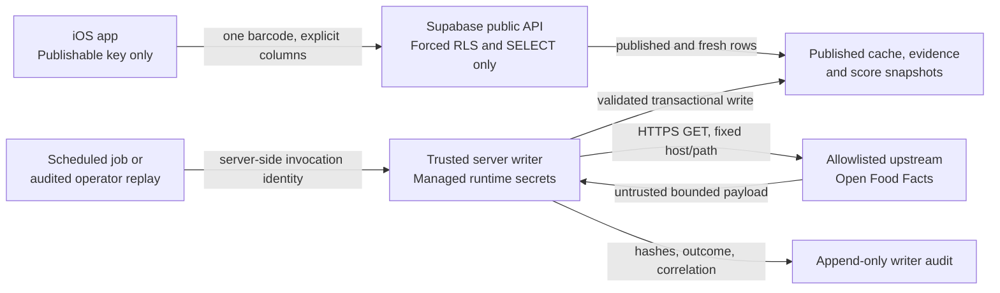

# Backend threat model and trust boundaries

## Trust Boundaries

This document visualizes the machine-readable threat model in
`backend-threat-model.yaml`. It defines the secure shape of the planned EU
Supabase development path. It does not provision a project, deploy a function,
connect Flutter or approve remote processing.

The trust boundaries are deliberately asymmetric. The mobile application may
read approved public rows but cannot request ingestion or mutate product facts,
evidence, relationships, methodology or scores. A cache miss falls back to the
current direct Open Food Facts path or a transparent no-data state.

## Security invariants

1. Flutter may contain a Supabase publishable key because mobile applications
   are public clients. It must never contain a secret, service-role key,
   database password or management token.
2. The trusted writer accepts jobs only from a scheduled server identity or an
   audited operator replay. It never accepts a writer request from the app.
3. Upstream access is HTTPS `GET` to exact allowlisted hosts and paths. Runtime
   arbitrary URLs, private addresses and unchecked redirects are rejected.
4. Payload, batch, concurrency, timeout, retry, daily-request and cost budgets
   are bounded before activation.
5. Every write is validated, idempotent, transactional and attributable. A
   published score snapshot is immutable and reproducible from its evidence.
6. Development, staging and production use separate projects and credentials.
   Production data is prohibited outside production.
7. Remote activation remains blocked until region/DPA, writer security and
   operational evidence satisfy their typed SHA-256 contracts.

## Residual boundary

The contract reduces implementation risk but is not a penetration test,
provider approval, GDPR legal review or operational incident exercise. Those
remain explicit activation evidence for NEXT-05 and later release work.

`G-BACKEND-BOUNDARY` validates these invariants and keeps remote activation
fail-closed until the typed review evidence is complete.
